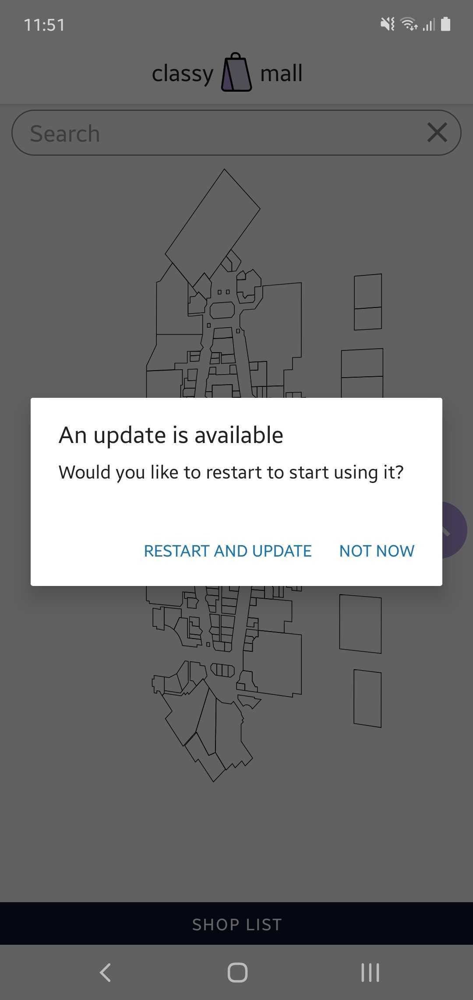

# `expo-ota-manager` example

This is an example project which implements [morrowdigital/expo-ota-manager](https://github.com/morrowdigital/expo-ota-manager) package.

`expo-ota-manager` is a helper plugin to manage Over-The-Air updates when your app is running.

## How to run the example

### Step 1: Clone the repo

### Step 2: Install packages
```sh
yarn install
```

### Step 3: Customize package name
You may want to change the package name in `package.json`
```json
{
  "name": "expo-ota-manager-example"
}
```
### Step 4: Create a custom .env file
In the `root` of your project create a `.env` file, from the `.env.example` file. Add in there your custom slug, and package names.
```text
# your expo account username (needed by expo-updates)
USERNAME=xxxx
# you will receive this after your run eas init               
EXPO_PROJECT_ID=xxxxx       
# your project slug
EXPO_SLUG=xxxxx             
# native (android and ios) package names
EXPO_BUNDLE_IDENTIFIER=com.yourdomain.xxxx 
```
> Note: Do not add the `EXPO_PROJECT_ID` yet

### Step 5: Obtain a `projectId`
Run
```shell
eas init
```
and ask for creating a new project. The command will prompt you to enter a newly created projectId into your app.config.js. Insert it in the `.env` file
```text
EXPO_PROJECT_ID=xxxxx       
```

### Step 6: Build the package
Run
```shell
yarn build:preview:android
```
or
```shell
yarn build:preview:ios
```
Follow instructions to build and download the package and install it on your device

### Step 7: Run the app
Upon running the app, your screen will show a specific hardcoded version

### Step 8: Test the manager
Edit the version in `App.tsx`:
```typescript jsx
<Text>Version 1.0.7</Text>
```
Then commit the changes and run
```shell
yarn publish:preview
```
Kill and restart your installed app.
After a while, you should see the OTA manager prompting you to restart your app




*** License (MIT)

Copyright 2023 Morrow Digital

Permission is hereby granted, free of charge, to any person obtaining a copy of this software and associated documentation files (the “Software”), to deal in the Software without restriction, including without limitation the rights to use, copy, modify, merge, publish, distribute, sublicense, and/or sell copies of the Software, and to permit persons to whom the Software is furnished to do so, subject to the following conditions:

The above copyright notice and this permission notice shall be included in all copies or substantial portions of the Software.

THE SOFTWARE IS PROVIDED “AS IS”, WITHOUT WARRANTY OF ANY KIND, EXPRESS OR IMPLIED, INCLUDING BUT NOT LIMITED TO THE WARRANTIES OF MERCHANTABILITY, FITNESS FOR A PARTICULAR PURPOSE AND NONINFRINGEMENT. IN NO EVENT SHALL THE AUTHORS OR COPYRIGHT HOLDERS BE LIABLE FOR ANY CLAIM, DAMAGES OR OTHER LIABILITY, WHETHER IN AN ACTION OF CONTRACT, TORT OR OTHERWISE, ARISING FROM, OUT OF OR IN CONNECTION WITH THE SOFTWARE OR THE USE OR OTHER DEALINGS IN THE SOFTWARE.

